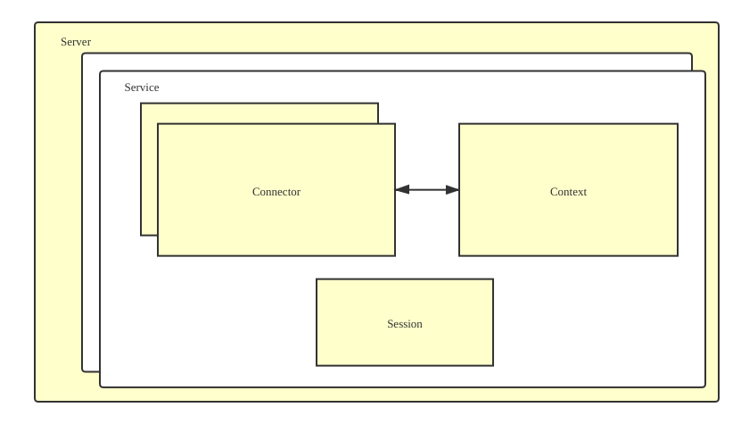
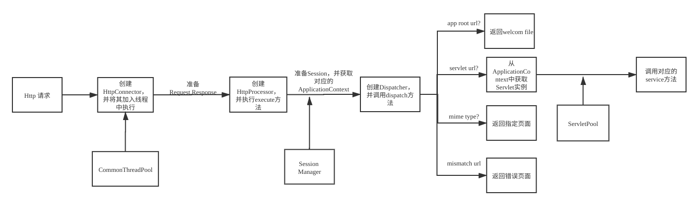

# TinyWebServer
一个小型的web服务器

### feature:

- Multi-application deployment
- Java servlet API support
- Application-Context manager
- Url Dispatcher
- HTTP/1.1 protocol support  
- HTTP request and response
- Cookie and Session
- Request Dispatcher and Response SendRedirect  
- 404 and 500 code status
- MIME type and welcome file support
- Log management

> default character set is UTF-8